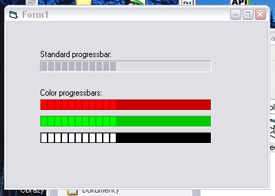

<div align="center">

## ColorProgressBars


</div>

### Description

This is sample how to made color progressbars using Windows CommonControls and Windows API.
 
### More Info
 


<span>             |<span>
---                |---
**Submitted On**   |2003-10-17 21:01:20
**By**             |[vViktor](https://github.com/Planet-Source-Code/PSCIndex/blob/master/ByAuthor/vviktor.md)
**Level**          |Intermediate
**User Rating**    |5.0 (20 globes from 4 users)
**Compatibility**  |VB 5\.0, VB 6\.0
**Category**       |[Windows API Call/ Explanation](https://github.com/Planet-Source-Code/PSCIndex/blob/master/ByCategory/windows-api-call-explanation__1-39.md)
**World**          |[Visual Basic](https://github.com/Planet-Source-Code/PSCIndex/blob/master/ByWorld/visual-basic.md)
**Archive File**   |[ColorProgr16600210172003\.zip](https://github.com/Planet-Source-Code/vviktor-colorprogressbars__1-49295/archive/master.zip)

### API Declarations

```
Private Declare Function SendMessage Lib "user32" Alias "SendMessageA" (ByVal hwnd As Long, ByVal wMsg As Long, ByVal wParam As Integer, ByVal lParam As Any) As Long
Private Const WM_USER = &H400
Private Const CCM_FIRST As Long = &H2000&
Private Const PBM_SETBARCOLOR As Long = (WM_USER + 9)
Private Const CCM_SETBKCOLOR As Long = (CCM_FIRST + 1)
Private Const PBM_SETBKCOLOR As Long = CCM_SETBKCOLOR
```


